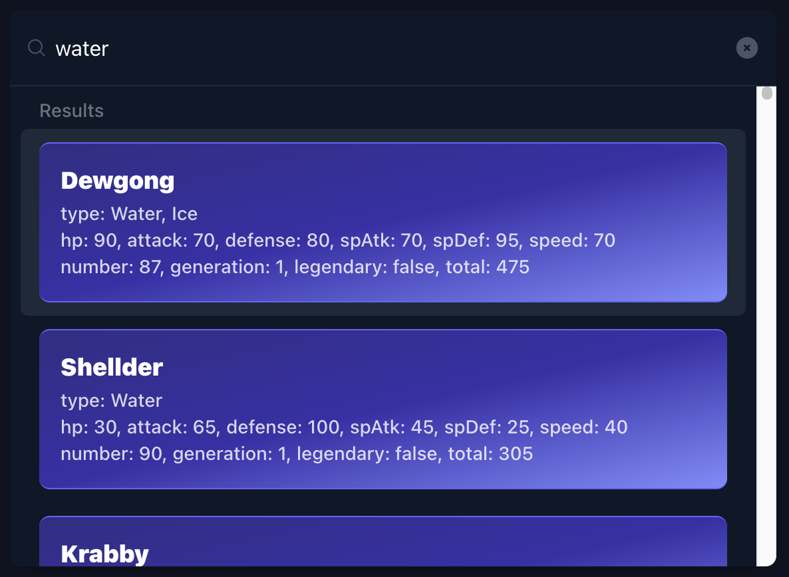
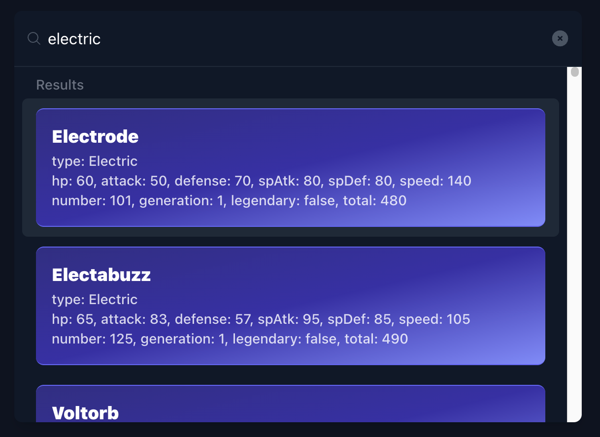
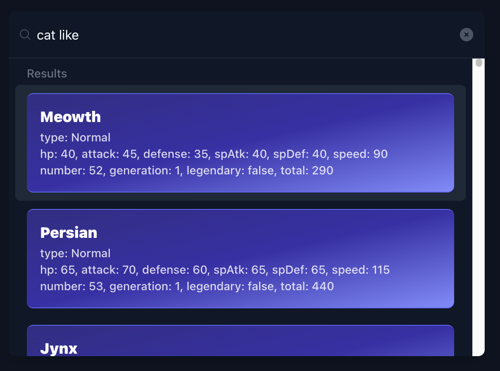

# CloseVector + Next.js Starter

A Next.js template that uses [CloseVector](https://closevector-docs.getmegaportal.com/) as the database, [CloseVector](https://closevector-docs.getmegaportal.com/) is a vector database that enables vector similarity search, which can run on both browser and server side.

This demo is a rewritten version of [postgres-pgvector](https://github.com/vercel/examples/tree/main/storage/postgres-pgvector#vercel-postgres--prisma--pgvector-nextjs-starter) provided by Vercel.

This demo aims to demonstrate how to use [CloseVector](https://closevector-docs.getmegaportal.com/) in Next.js, and how to use [CloseVector](https://closevector-docs.getmegaportal.com/) to implement a simple search engine. Also, it demonstrates the inserting performance of [CloseVector](https://closevector-docs.getmegaportal.com/)

## Demo

https://closevector-nextjs-demo.vercel.app/





## How to Use


### Getting CloseVector Access Key

If you want to use the embedding API provided by CloseVector, as demonstrated in this demo, you need to obtain an access key from [CloseVector](https://closevector.getmegaportal.com/).

Alternatively, you can implement your own embedding using the OpenAI API by extending the class [CloseVectorEmbeddings](https://closevector-docs.getmegaportal.com/docs/api/closevector-web#closevectorembeddings) and passing it to `useCloseVectorManager`.

### Deploying

You can choose from one of the following two methods to use this repository:

### One-Click Deploy

[](https://vercel.com/new/clone?repository-url=https%3A%2F%2Fgithub.com%2FMegaPortal%2Fclosevector-nextjs-demo)

### Clone and Deploy

Execute [`create-next-app`](https://github.com/vercel/next.js/tree/canary/packages/create-next-app) with [pnpm](https://pnpm.io/installation) to bootstrap the example:

```bash
pnpm create next-app --example https://github.com/MegaPortal/closevector-nextjs-demo
```

Once that's done, copy the .env.example file in this directory to .env.local (which will be ignored by Git):

```bash
cp .env.example .env.local
```

Then open `.env.local` and set the environment variables to match the ones in your Vercel Storage Dashboard.

Next, run Next.js in development mode:

```bash
pnpm dev
```

Deploy it to the cloud with [Vercel](https://vercel.com/new?utm_source=github&utm_medium=readme&utm_campaign=vercel-examples) ([Documentation](https://nextjs.org/docs/deployment)).